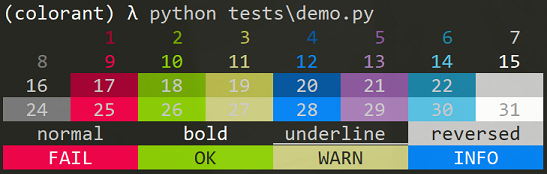

# Colorant

## Intro

- Sets text colors and effects in console.

## Features

- Foreground and background colors
  - Black
  - Red
  - Green
  - Yellow
  - Blue
  - Magenta
  - Cyan
  - White
  - Bright black
  - Bright red
  - Bright green
  - Bright yellow
  - Bright blue
  - Bright magenta
  - Bright cyan
  - Bright white
- Decorations
  - Bold
  - Underline
  - Reversed

## Reference

1. [Build your own Command Line with ANSI escape codes](https://www.lihaoyi.com/post/BuildyourownCommandLinewithANSIescapecodes.html)
2. [ANSI escape code](https://en.wikipedia.org/wiki/ANSI_escape_code)
3. [Colors In Terminal](http://jafrog.com/2013/11/23/colors-in-terminal.html)
4. [STY](https://sty.mewo.dev/index.html)
